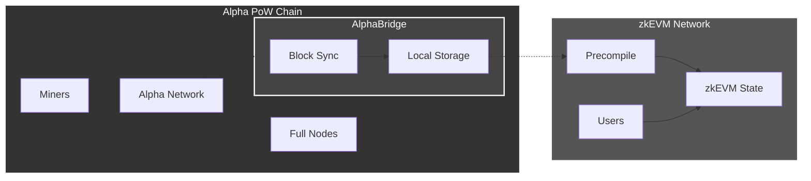
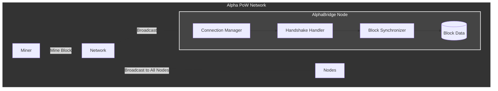
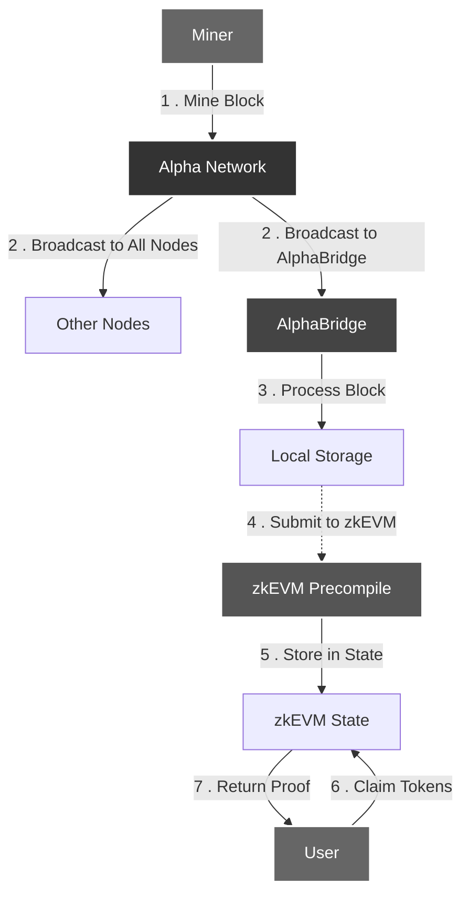
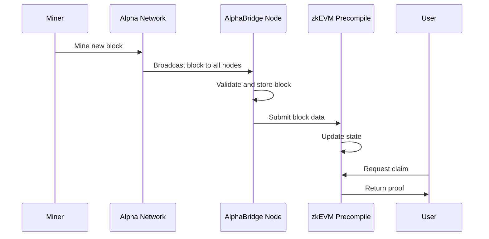

# AlphaBridge

`unicity-alphabridge` is a critical component of the Unicity Prism ecosystem that serves as a bridge
between the Alpha Proof-of-Work (PoW) chain and the zkEVM layer. This crate implements a P2P client
that connects to the Alpha chain network to continuously synchronize blocks, enabling users to claim
their coins on the new zkEVM network.

## Purpose

The primary goal of AlphaBridge is to facilitate the migration from the Alpha PoW chain to the zkEVM
by:

1. **Connecting to the Alpha P2P network** - Establishing connections with Alpha chain peers
2. **Synchronizing blockchain data** - Continuously fetching new blocks as they are mined
3. **Submitting blocks to zkEVM** - Forwarding signed blocks to a zkEVM precompile for validation
4. **Enabling token claims** - Providing the necessary block data for users to claim tokens on the
   new network

## How It Works

### Current State

Currently, AlphaBridge implements a Bitcoin-like P2P client that can:

- Connect to Alpha chain peers (mainnet, testnet, or regtest)
- Perform peer handshakes and negotiate protocol versions
- Synchronize block headers and full block data
- Handle connection management with configurable timeouts

### Future Implementation

The complete implementation will:

1. **Monitor the Alpha chain** for new blocks as they are mined by validators
2. **Extract signed block data** from miners who are essentially signing off on block validity
3. **Submit block data** to a zkEVM precompile contract that will:
  - Maintain the latest tip of the Alpha blockchain
  - Self-validate incoming blocks
  - Store block data for token claim verification
4. **Disable coin movement** on the Alpha chain, making it a read-only source of truth

## Architecture

AlphaBridge is designed to operate within the P2P layer of the Alpha PoW chain and consists of:

- **Connection Manager** - Handles TCP connections to Alpha peers
- **Handshake Handler** - Manages protocol negotiation with peers
- **Block Synchronizer** - Downloads and validates block data
- **zkEVM Submitter** - (Future) Submits validated blocks to the zkEVM

### High-Level Architecture



### Current Implementation



### Complete Data Flow



### Component Interaction



## Usage

### Running AlphaBridge

```bash
# Connect to testnet with default settings
cargo run --bin alphabridge -- --network testnet

# Connect to specific peers
cargo run --bin alphabridge -- --connect 127.0.0.1:8590,192.168.1.100:8590

# Sync from a specific block height
cargo run --bin alphabridge -- --start-height 500000 --max-blocks 1000

# Download only headers (faster sync)
cargo run --bin alphabridge -- --download-full-blocks false
```

### Configuration Options

- `--network`: Network to connect to (mainnet, testnet, regtest)
- `--connect`: Comma-separated list of peer addresses
- `--max-connections`: Maximum number of peer connections (default: 5)
- `--start-height`: Block height to start syncing from (default: 0)
- `--max-blocks`: Maximum number of blocks to sync (default: 1000)
- `--user-agent`: Custom user agent string
- `--log-level`: Logging verbosity (trace, debug, info, warn, error)
- `--connect-timeout`: Connection timeout in seconds (default: 30)
- `--read-timeout`: Read timeout in seconds (default: 60)
- `--write-timeout`: Write timeout in seconds (default: 30)
- `--download-full-blocks`: Whether to download full blocks or just headers (default: true)

## Dependencies

AlphaBridge relies on several key dependencies:

- `unicity-prism-common`: Shared types and utilities for the Alpha chain
- `unicity-prism-derive`: Custom derive macros for serialization
- `bitcoin`: Bitcoin protocol implementation for P2P networking
- `tokio`: Asynchronous runtime
- `tracing`: Structured logging
- `clap`: Command-line argument parsing

## Network Configuration

AlphaBridge connects to different Alpha chain networks:

- **Mainnet**: Production Alpha chain network
- **Testnet**: Testing environment for development
- **Regtest**: Local regression testing network

Default peer addresses are provided for each network, but custom peers can be specified using the
`--connect` option.

## Roadmap

1. **Complete P2P Implementation** - Full Alpha chain protocol support
2. **Block Validation** - Verify block signatures and structure
3. **zkEVM Integration** - Submit blocks to zkEVM precompile
4. **Monitoring Dashboard** - Real-time sync status and health metrics
5. **Automatic Failover** - Resilient peer connection management

## Contributing

This crate is part of the Unicity Prism project. Please follow the project's contribution guidelines
when submitting changes.

## License

This project is licensed under the MIT License.
